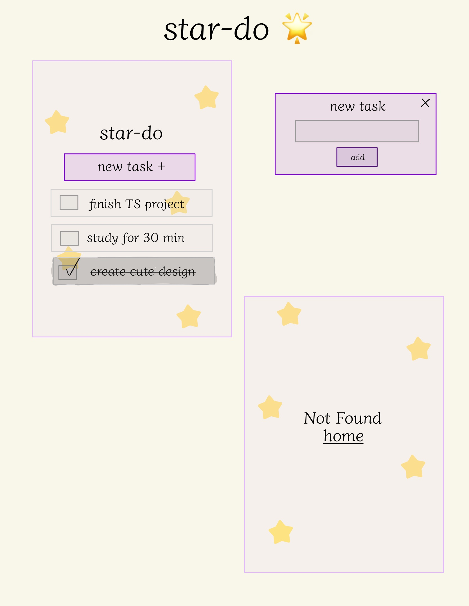

# 🌟 Star-do

A simple To-Do app star themed

## 🎨 Design

## 🎯 Features

- Create a task
- Check/Uncheck a task
- Delete a task
- Not Found page

### Future Features

- Create login/register
- Store how many tasks completed in the day
- Store tasks by day
- Add tests with `vitest` and `cypress`

## ⚙️ Installation & Usage

- Clone or download the repo
- `npm install` to install all dependencies
- `npm run dev` to launch server

## 💻 Technologies

## 👀 Demo

https://github.com/code-carol/star-do/assets/88780435/7635f39b-3191-498c-bd79-f67b22048a2a

## 📚 Lessons Learned

- Create folder structure with TypeScript + React
- How to configure TypeScript and Vite together
- What packages to install for TS
- use `interface` to assign the type of the props
- Create simple rotation animation
- Create a custom checkbox
- How to pass onClick events as props with TS
- How to pass set actions as props with TS
- Create a Types File
- Store on LocalStorage

## ✨ Inspiration

- [Star by @softiie\_](https://picsart.com/i/343808251035211?_branch_match_id=1170471212046291557&_branch_referrer=H4sIAAAAAAAAA8soKSkottLXL8hMLk4sKtFLLCjQy8nMy9avcPFMCvUz93HMSgIAcknNFiQAAAA%3D)

- [TODO List App - Web Dev Simplified](https://www.youtube.com/watch?v=jBmrduvKl5w)
